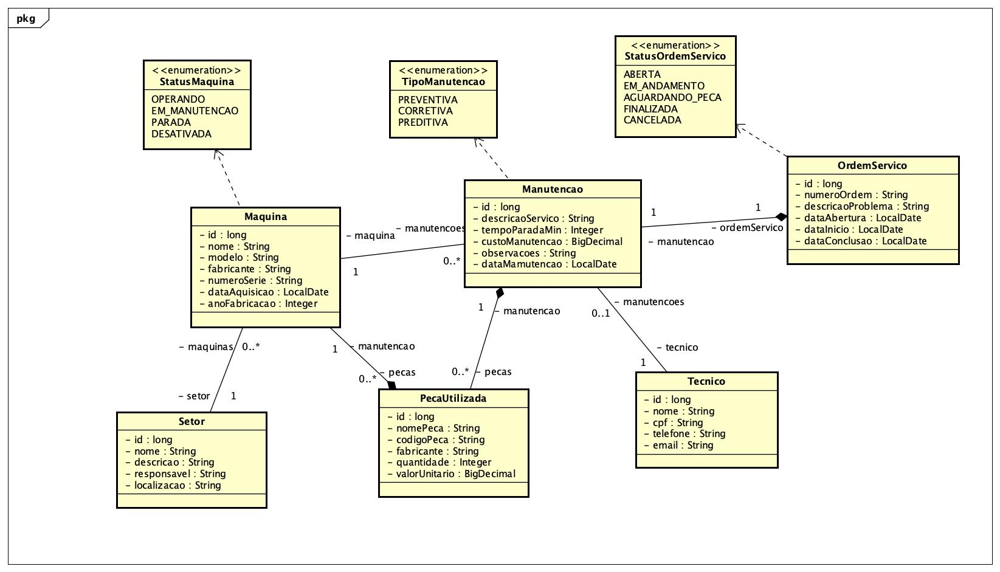

# 🔧 Engrena Backend

Sistema backend para **gestão de manutenção industrial de máquinas**, permitindo controlar ordens de serviço, técnicos responsáveis, peças utilizadas e histórico de manutenção.

Este projeto foi desenvolvido utilizando **Spring Boot** seguindo boas práticas de arquitetura em camadas.

---

# 📌 Objetivo

O objetivo do sistema é permitir o **controle e acompanhamento de manutenções de máquinas industriais**, organizando informações como:

* Máquinas cadastradas
* Técnicos responsáveis
* Ordens de serviço
* Manutenções realizadas
* Peças utilizadas em cada manutenção
* Setores da empresa

Esse tipo de sistema é comum em **ambientes industriais e metalúrgicos**, auxiliando no **controle de manutenção preventiva e corretiva**.

---

# 🛠️ Tecnologias utilizadas

* Java 17
* Spring Boot
* Spring Data JPA
* Hibernate
* H2 Database
* Maven
* Lombok
* IntelliJ IDEA

---

# 🏗️ Arquitetura do Projeto

O projeto segue o padrão **arquitetura em camadas**, separando responsabilidades.

```
src/main/java/com
│
├── config
├── domains
│   ├── dtos
│   ├── enums
│   └── entities
│
├── repositories
├── services
├── resources (controllers)
├── mappers
├── infra
└── exceptions
```

### Camadas

**Entity**

Representação das tabelas do banco de dados.

**DTO**

Objetos usados para transferência de dados entre API e cliente.

**Mapper**

Responsável por converter **Entity ↔ DTO**.

**Repository**

Camada de acesso ao banco utilizando **Spring Data JPA**.

**Service**

Onde fica a **regra de negócio da aplicação**.

**Resource (Controller)**

Responsável pelos **endpoints REST da API**.

---

# 📊 Diagrama de Classes

Abaixo está o diagrama de classes que representa a estrutura do sistema.


---

# 🗄️ Modelo de Dados

Principais entidades do sistema:

* **Setor**
* **Máquina**
* **Técnico**
* **Ordem de Serviço**
* **Manutenção**
* **Peça Utilizada**

Relacionamentos principais:

```
Setor
  ↓
Maquina
  ↓
Manutencao
  ↓
PecaUtilizada

Tecnico → Manutencao
OrdemServico → Manutencao
```

---

# 🚀 Executando o projeto

### 1️⃣ Clonar o repositório

```bash
git clone https://github.com/seu-usuario/engrena-backend.git
```

### 2️⃣ Entrar na pasta

```bash
cd engrena-backend
```

### 3️⃣ Executar o projeto

```bash
mvn spring-boot:run
```

Ou execute diretamente pela classe:

```
EngrenaBackendApplication
```

---

# 🗄️ Banco de Dados

O projeto utiliza **H2 Database em memória**.

Console disponível em:

```
http://localhost:8080/h2-console
```

Configuração:

```
JDBC URL: jdbc:h2:mem:cursodb
User: sa
Password:
```

---

# 📡 Endpoints da API

Principais rotas disponíveis:

### Setores

```
GET /api/v1/setores
POST /api/v1/setores
PUT /api/v1/setores/{id}
DELETE /api/v1/setores/{id}
```

### Máquinas

```
GET /api/v1/maquinas
POST /api/v1/maquinas
PUT /api/v1/maquinas/{id}
DELETE /api/v1/maquinas/{id}
```

### Técnicos

```
GET /api/v1/tecnicos
POST /api/v1/tecnicos
PUT /api/v1/tecnicos/{id}
DELETE /api/v1/tecnicos/{id}
```

### Ordens de Serviço

```
GET /api/v1/ordens-servico
POST /api/v1/ordens-servico
PUT /api/v1/ordens-servico/{id}
DELETE /api/v1/ordens-servico/{id}
```

### Manutenções

```
GET /api/v1/manutencoes
POST /api/v1/manutencoes
PUT /api/v1/manutencoes/{id}
DELETE /api/v1/manutencoes/{id}
```

### Peças Utilizadas

```
GET /api/v1/pecas-utilizadas
POST /api/v1/pecas-utilizadas
PUT /api/v1/pecas-utilizadas/{id}
DELETE /api/v1/pecas-utilizadas/{id}
```

---

# 📚 Funcionalidades

✔ Cadastro de máquinas
✔ Cadastro de técnicos
✔ Controle de ordens de serviço
✔ Registro de manutenções
✔ Controle de peças utilizadas
✔ Relacionamento entre entidades
✔ API RESTful

---

# 👨‍💻 Autor

Desenvolvido por **Lucas Sabadini Mendes**

Estudante de **Sistemas de Informação** e desenvolvedor backend focado em **Java e Spring Boot**.

---
